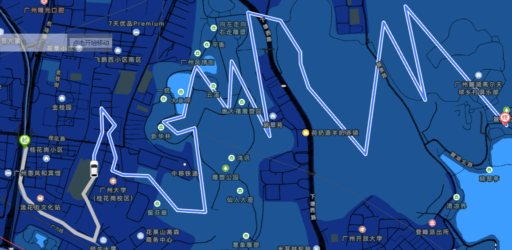

<p align="center">
    
</p>
<h1 align="center">开源免费生活轨迹记录软件</h1>
<p align="center">
    <a href="https://github.com/cctyl/TrackRecord/issues" style="text-decoration:none">
        
    </a>
    <a href="https://github.com/cctyl/TrackRecord/stargazers" style="text-decoration:none" >
        
    </a>
    <a href="https://github.com/cctyl/TrackRecord/network" style="text-decoration:none" >
        
    </a>
</p>

# 前言
[项目地址](https://github.com/cctyl/TrackRecord) 
[演示视频](https://www.bilibili.com/video/BV1tu411L7qW)

一款记录你走过的位置的软件，只要将软件启动，放在后台。那么软件会每间隔半小时获取一次当前的位置
然后上传到服务器当中。用户在web端直接打开浏览器查看指定时间范围内的轨迹。
例如： 昨天我去过哪里？上一周我经常去哪？这一年我都待过哪些地方？
类似塞尔达中的痕迹地图。


做的比较简陋，只完成了基本功能。


# 截图

- android端

	- 主界面，基本只看一次： 
	- 启动后的通知界面：  
	
- web端
	- 时间范围选择： 
	- 轨迹界面  

# 测试
可以使用腾讯地图的坐标拾取器：https://lbs.qq.com/getPoint/，获取当前时间戳：https://tool.lu/timestamp/
选择几个点，然后通过postman发起请求上传到后端，再到web端查看效果

```
POST /gps/addMany
[
    {
        "latitude": 23.097297,
        "longitude": 113.313828,
        "model": "xiaomi",
        "time": 1689575872000
    },
   {
        "latitude":  23.137838,
        "longitude": 113.24421,
        "model": "xiaomi",
        "time": 1689575872000
    },
    {
        "latitude":  23.139269,
        "longitude": 113.295073,
        "model": "xiaomi",
        "time": 1689575872000
    }
] 
```

# 说明
本软件分为三个部分：
-	server nodejs+mongodb
-	web	vue+腾讯地图

	为了安全起见，web端可以放到本地电脑上。当然也可以直接发布到线上，已经做了允许跨域
-	android XXPermission+高德地图SDK+XLog+okhttp
	
	这里注意，android端写的特别的烂，只是勉强实现了保活和获取定位发送定位等功能，不值得学习。
	等待后续重构


    
    
# 食用

## 准备工作
- 申请腾讯地图的api
	
	https://lbs.qq.com/dev/console/application/mine
	创建一个应用
	
	设置：
	设置成功：
	
	得到的key将用于index.html中

- 申请高德地图的api
	https://console.amap.com/dev/key/app
	
	点击创建应用：
	设置：
	这里，安全编码的获取方式查看: https://lbs.amap.com/faq/android/map-sdk/create-project/43112
	完成：
	
	
	
## 服务端环境要求

- nodejs16
- mongodb


## 步骤
1. git clone
2. 修改配置
- android部分：

	TrackRecord\android\app\src\main\java\cn\tyl\gps_demo\util\HttpUtil.java

	第30行：修改你的后端地址

	```java
	private static final String URL = "http://你的后端地址"; 
	```

	第52行：修改你的accessToken

	```java
	.header("token", "你的后端token")
	```

	TrackRecord\android\app\src\main\AndroidManifest.xml

	第48行：android:value部分，改为你的高德地图sdk的key

	```xml
	 <meta-data android:name="com.amap.api.v2.apikey" android:value="xxxxx">
	```


- server部分：

	TrackRecord\server\app.js

	第42行：定义你的accessToken，这个token会用于 android 和web端的访问

	```js
	let accessToken = "你的token";
	```

	TrackRecord\server\model\db.js

	如果你的mongodb需要密码，则打开 8-16行注释，并修改第9行的账号密码

	```js
	/*
	mongoose.connect('mongodb://账号:密码@127.0.0.1:27017/gps?authSource=admin',function (err) {

		if (err)
			console.log(err)
		else
			console.log("数据库连接成功")
	});
	*/
	```

	如果你的mongodb不需要密码，并且端口也是默认的，那么无需修改


- web部分：

	TrackRecord\web\index.html

	第18行： 修改腾旭地图的apikey为你自己申请的key

	```html
	<script src="https://map.qq.com/api/gljs?v=1.exp&key=你的腾讯地图apikey"></script>
	```

	第68、69行： 修改你后端的accessToken 和 后端url

	```js
	   base_url: 'http://你的后端地址',
	   accessToken:"你的后端访问token"
	```


3. server发布
	先安装相关依赖：
	```shell
		cd server
		npm install
	```
	然后，直接将server文件夹打包上传到服务器，解压，node ./bin/www 即可
	如果需要长时间运行，可以使用pm2.当然docker也完全可以
	

4. 测试
	
	此时可以尝试用postman向server发送请求，然后直接打开web文件夹下的index.html，查看点位是否生效
	
5. android应用的打包
	
	配置好环境，修改对应key，直接打包release版本安装即可。
	安装完成后，进入应用点击启动，通知栏开始出现通知，表示启动成功。
	需要打开gps开关，该应用需要保持后台运行，请在白名单放行并且后台加锁
	